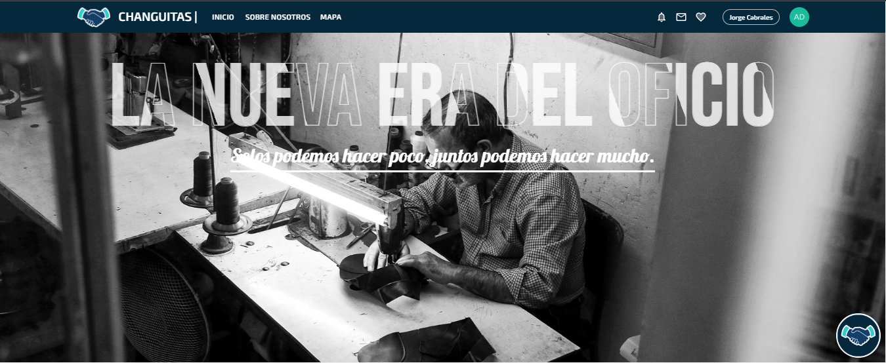
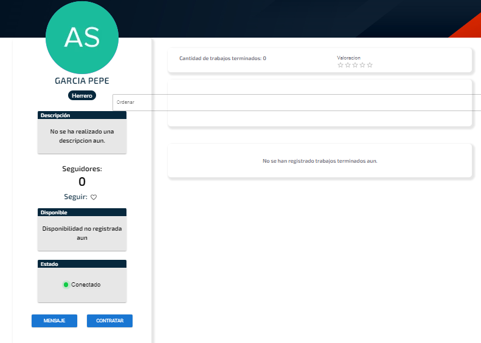
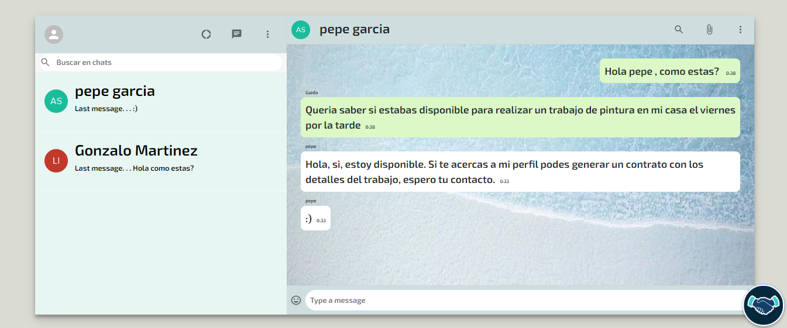

<h1 align="center">Hola 👋, Soy Manuel Ignacio Canavari</h1>
<h3 align="center">Apasionado por el mundo IT, actualmente estudiando Analista de Sistemas</h3>

Hola 👋,

Soy Manuel, un apasionado Desarrollador Web 😄 con una sólida formación en Full Stack Development y Analista de Sistemas en Escuela Da Vinci. Desde temprana edad, me enamoré de la tecnología y decidí dedicarme por completo a esta pasión.

💼 Experiencia y Habilidades:
Soy un apasionado desarrollador que se destaca tanto en el Frontend como en el Backend. Mi experiencia abarca tecnologías como React, Redux, JavaScript (ES6), Node.js, Express, MySQL, PostgreSQL, Sequelize, Socket.io y TypeScript. También poseo habilidades en React Native, metodologías ágiles, Git, Github, APIs RESTful, Bootstrap, Sequelize, Styled Components, CSS Modules y HTML.

💡 Por qué elegirme:
Soy un solucionador de problemas comprometido y proactivo, dedicado a encontrar soluciones creativas y efectivas para los desafíos del equipo. Mi mentalidad orientada al equipo, liderazgo y habilidades autodidactas me permiten contribuir significativamente a cualquier proyecto.

🌟 Proyectos Destacados:
He trabajado en proyectos significativos que han ampliado mi experiencia en el desarrollo web. Puedes echar un vistazo a mis trabajos anteriores en mi <a href="https://portfolio-iu2u.onrender.com/#portfolio">Portfolio</a>

📫 Contacto:
Estoy entusiasmado por la oportunidad de contribuir a tu equipo. Si estás interesado en mi perfil, no dudes en contactarme a través de mi correo electrónico: manuel.canavari43@gmail.com o visitar <a href="https://www.linkedin.com/in/manuel-canavari/">LinkedIn</a>.

📍 Ubicación:
Actualmente resido en Avigliano, Italia 🌎.

¡Espero tener la oportunidad de trabajar contigo y contribuir al éxito de tu equipo!

Saludos,
Manuel 👨‍💻

Ciao 👋,

Sono Manuel, un appassionato sviluppatore web 😄 con una solida formazione in Full Stack Development e Analista di Sistemi presso la Scuola Da Vinci. Fin da giovane, mi sono innamorato della tecnologia e ho deciso di dedicarmi completamente a questa passione.

💼 Esperienza e Competenze:
Sono uno sviluppatore appassionato che eccelle sia nel Frontend che nel Backend. La mia esperienza include tecnologie come React, Redux, JavaScript (ES6), Node.js, Express, MySQL, PostgreSQL, Sequelize, Socket.io e TypeScript. Possiedo anche competenze in React Native, metodologie agili, Git, Github, API RESTful, Bootstrap, Sequelize, Styled Components, CSS Modules e HTML.

💡 Perché Scegliermi:
Sono un risolutore di problemi impegnato e proattivo, dedicato a trovare soluzioni creative ed efficaci per le sfide di squadra. La mia mentalità orientata al team, leadership e competenze autodidattiche mi permettono di contribuire significativamente a qualsiasi progetto.

🌟 Progetti Rilevanti:
Ho lavorato su progetti significativi che hanno ampliato la mia esperienza nello sviluppo web. Puoi dare un'occhiata ai miei lavori precedenti nel mio <a href="https://portfolio-iu2u.onrender.com/#portfolio">Portafoglio</a>

📫 Contatti:
Sono entusiasta all'idea di contribuire al tuo team. Se sei interessato al mio profilo, non esitare a contattarmi via email: manuel.canavari43@gmail.com o visita il mio <a href="https://www.linkedin.com/in/manuel-canavari/">LinkedIn</a>.

📍 Posizione:
Attualmente risiedo ad Avigliano, Italia 🌎.

Spero di avere l'opportunità di lavorare con te e contribuire al successo del tuo team!

Saluti,
Manuel 👨‍💻

 Hello 👋,

I'm Manuel, a passionate Web Developer 😄 with a solid background in Full Stack Development and Systems Analyst at Escuela Da Vinci. Since a young age, I fell in love with technology and decided to fully dedicate myself to this passion.

💼 Experience and Skills:
I'm a dedicated developer excelling in both Frontend and Backend. My expertise spans technologies like React, Redux, JavaScript (ES6), Node.js, Express, MySQL, PostgreSQL, Sequelize, Socket.io, and TypeScript. I also have skills in React Native, agile methodologies, Git, Github, RESTful APIs, Bootstrap, Sequelize, Styled Components, CSS Modules, and HTML.

💡 Why Choose Me:
I'm a committed and proactive problem solver, dedicated to finding creative and effective solutions for team challenges. My team-oriented mindset, leadership, and self-taught skills enable me to contribute significantly to any project.

🌟 Notable Projects:
I've worked on significant projects that have expanded my experience in web development. You can check out my previous work in <a href="https://portfolio-iu2u.onrender.com/#portfolio">Portfolio</a>

📫 Contact:
I'm excited about the opportunity to contribute to your team. If you're interested in my profile, feel free to reach out via email: manuel.canavari43@gmail.com or visit my <a href="https://www.linkedin.com/in/manuel-canavari/">LinkedIn</a>.

📍 Location:
Currently residing in Avigliano, Italy 🌎.

Looking forward to the opportunity to work with you and contribute to your team's success!

Best regards,
Manuel 👨‍💻

  

- 📫 How to reach me **manuel.canavari43@gmail.com**
- Linkedin **https://www.linkedin.com/in/manuel-canavari/**
- Portfolio: **https://portfolio-iu2u.onrender.com/#portfolio**

<h3 align="left">Connect with me:</h3>

 

<h3 align="left">Languages and Tools:</h3>

                 

&nbsp;

<a href="https://font-pf.vercel.app/" target="_blank"> https://font-pf.vercel.app/</a>

